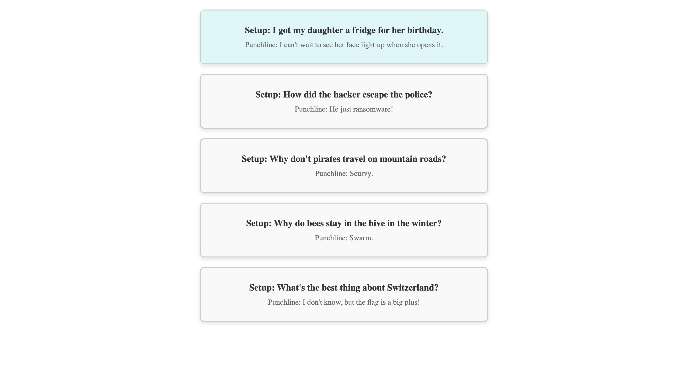

# Scrimba-React-ExtractExternalFileObject

This project is a React-based application that dynamically renders a list of jokes by extracting data from an external file and mapping it into components.

## Features

- **React Components**: The jokes are displayed using a `Joke` component.
- **External Data**: The joke data is stored in an external file (`JokesData.js`) and is passed into the `Joke` component.
- **Functional Rendering**: Jokes are rendered dynamically using the `map()` function.

## Visual Design



## Installation

1. Clone the repository:
   ```bash
   git clone https://github.com/BhoomiGohil/Scrimba-React-ExtractExternalFileObject.git
   ```
2. Navigate into the project directory:
   ```bash
   cd Scrimba-React-ExtractExternalFileObject
   ```
3. Install the dependencies:
   ```bash
   npm install
   ```

## Usage

1. Start the React app:
   ```bash
   npm start
   ```
2. Open your browser and navigate to `http://localhost:3000` to view the list of jokes.

## Folder Structure

- `src/JokesData.js`: Contains the list of jokes (with `setup` and `punchline`).
- `src/Joke.js`: A component that renders the individual joke using `props`.
- `src/index.js`: The entry point that renders the `MainContent` component, which maps over the jokes.

## CSS Styling

Basic styling is provided to format and display the jokes nicely, making use of a responsive design for smaller screens.

## Example

Here’s an example of a joke rendered in the app:

```javascript
<Joke setup="Why don't pirates travel on mountain roads?" punchline="Scurvy." />
```
